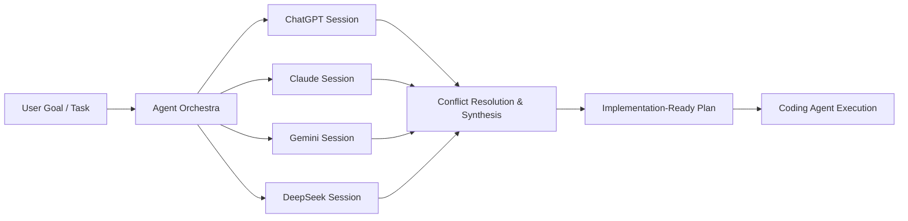

<div align="center">

<!-- HERO BANNER -->


<!-- ANIMATED TYPING SUBHEADER -->
<a href="https://happy-sharma-resume.vercel.app/">
  
</a>

<br/>

<!-- STATUS & SOCIAL SHIELDS -->
<p align="center">
  <a href="https://happy-sharma-resume.vercel.app/">
    
  </a>
  <a href="mailto:happycse54@gmail.com">
    
  </a>
  <a href="https://pypi.org/project/pyerror-intel/">
    
  </a>
  <a href="https://github.com/Happy-Kumar-Sharma?tab=repositories">
    
  </a>
</p>

</div>

---

### 🕹️ Developer RPG Status Board

```yaml
Character: Happy Kumar Sharma
Title: Senior Systems Architect & Open-Source Creator
Level: 26 [████████████████████████░] 96% EXP
Base Class: Python & Full-Stack Specialist
Subclass: Autonomous Agent Orchestrator & Toolsmith
Active Guild: BusinessAra (Founder & Lead Developer)
Location: Ahmedabad, Gujarat, India 📍

Attributes:
  ⚡ Code Resilience:   [████████████████████] 98/100 (TDD, Pytest, Pyerror)
  🧠 System Topology:   [███████████████████░] 94/100 (FastAPI, Redis, Kafka, NiFi)
  🛡️ Security Armor:    [██████████████████░░] 92/100 (Keycloak S2S, Data Masking)
  🤖 LLM Synergy:       [███████████████████░] 95/100 (Zero-cost Multi-Agent Workflows)

Passive Buffs:
  - [pyerror-intel]: Grants +50% Error Immunity & instant traceback diagnostics
  - [SecureLogs]: 100% PII stealth masking on all inbound/outbound traces
  - [CodeSight]: +40% Debug Insight inspecting DAP call stacks in real time
```

---

## 🎮 Contribution History & The Arcade Snake Arena

<div align="center">

> *"Every commit is a pellet eaten. Every pull request is a boost combo. Watch the snake harvest the grid!"*

<!-- GITHUB CONTRIBUTION SNAKE ANIMATION -->
<picture>
  <source media="(prefers-color-scheme: dark)" srcset="https://raw.githubusercontent.com/Happy-Kumar-Sharma/Happy-Kumar-Sharma/output/github-contribution-grid-snake-dark.svg">
  <source media="(prefers-color-scheme: light)" srcset="https://raw.githubusercontent.com/Happy-Kumar-Sharma/Happy-Kumar-Sharma/output/github-contribution-grid-snake.svg">
  
</picture>

</div>

### 👾 Game Logic & Mechanics Deconstruction

<table>
<tr>
<td width="50%" valign="top">

#### 🐍 1. GitHub Contribution Snake Engine (`snk`)
* **Core Loop:** The automated runner parses the GitHub GraphQL contribution matrix as an $n \times m$ grid world.
* **Pathfinding:** Employs an intelligent Hamiltonian cycle / $A^*$ heuristic to navigate across high-density commit clusters.
* **Scoring Rules:**
  * 🟩 **Light Green (1-3 Commits):** +10 Snake Energy
  * 🟢 **Medium Green (4-9 Commits):** +25 Combo Multiplier
  * ❇️ **Dark Neon (10+ Commits):** Boss Pellet (+100 XP)
* **Automated Sync:** Runs continuously via GitHub Actions on every midnight schedule.

</td>
<td width="50%" valign="top">

#### 🏅 2. LineUp — Real-Time Pickup Sports Game
* **Genre:** Geo-Distributed Pickup Sports Matchmaking & Lobbies
* **Core Rule:** `notify = (distance_to_venue ≤ radius_km) OR (city_id == game.city_id)`
* **Mechanics:**
  * **Smart Reach Engine:** Eliminates ghost lobbies in quieter neighborhoods by dynamically fanning out invites.
  * **Roster Slot Locking:** Live seat reservation, confirmations, and attendance rosters across cricket, football, tennis, and badminton.
  * **Android Native + Responsive Web Client** with 31 interactive screens and map layers.

</td>
</tr>
<tr>
<td width="50%" valign="top">

#### 🧠 3. TechQuiz Tournament Engine
* **Genre:** Interactive Technical Trivia & Speed Tournament
* **Mechanics:**
  * **Streak Multipliers:** Correct successive answers increase points quadratically ($Score \times 1.5^n$).
  * **Time-Attack:** Sub-second response bonus thresholds rewarding speed and deep CS fundamentals.
  * **Dynamic Categories:** Algorithms, System Design, Security, and Cloud Architecture.

</td>
<td width="50%" valign="top">

#### 🎵 4. Mouzikka Rhythm Audio System
* **Genre:** Native Audio Architecture & Playlist Engine
* **Mechanics:**
  * **Stateful Queueing:** Low-latency playback buffer with background thread safety.
  * **Audio Spectrum:** Clean waveform visualization and responsive volume ducking.
  * **Offline-First:** Zero-lag local media indexing and seamless playlist persistence.

</td>
</tr>
</table>

---

## 🚀 Flagship Open-Source Libraries & Packages

<div align="center">

| Project & PyPI | Focus & Architecture | Live Status |
| :--- | :--- | :---: |
| [**`pyerror-intel`**](https://github.com/Happy-Kumar-Sharma/error)<br/>`pip install pyerror-intel` | **Python Error Intelligence Ecosystem**<br/>28 public APIs. Humanizes tracebacks, masks sensitive scope variables, generates AI-assisted remediation suggestions, and integrates with production logging. | [](https://pypi.org/project/pyerror-intel/) |
| [**`trace-logger / SecureLogs`**](https://github.com/Happy-Kumar-Sharma/trace-logger)<br/>`pip install SecureLogs` | **PII & Sensitive Value Masking Logger**<br/>Automated correlation trace IDs, contextual log masking for credit cards, tokens, and PII in high-throughput FastAPI/microservices. | [](https://pypi.org/project/SecureLogs/) |
| [**`mongo-migrate`**](https://github.com/Happy-Kumar-Sharma/mongo-migrate) | **Declarative MongoDB Migration Engine**<br/>Fast, reliable Python migration tool with bidirectional rollbacks, verification locks, and zero-downtime execution. | [](https://github.com/Happy-Kumar-Sharma/mongo-migrate) |
| [**`s2s-auth-keycloak`**](https://github.com/Happy-Kumar-Sharma/s2s-auth-keycloak) | **Keycloak Microservices M2M Auth**<br/>Lightweight service-to-service JWT token acquisition, caching, validation, and auto-refresh for distributed backends. | [](https://github.com/Happy-Kumar-Sharma/s2s-auth-keycloak) |
| [**`db-migration`**](https://github.com/Happy-Kumar-Sharma/db-migration) | **Universal Database Schema Migration Tool**<br/>Lightweight CLI and library for tracking and executing multi-database schema revisions. | [](https://github.com/Happy-Kumar-Sharma/db-migration) |

</div>

---

## 🧩 VS Code Extensions

<table>
<tr>
<td width="50%" align="center">
<a href="https://github.com/Happy-Kumar-Sharma/CodeSight-Open-Dynamic-Visualizer">
  
</a>
<br/><br/>
<p align="left">
<b>🔍 CodeSight: Open Dynamic Visualizer</b><br/>
A developer extension that connects directly to the <b>Debug Adapter Protocol (DAP)</b> to draw a live, interactive visualization of program state in a side panel. Inspect call stacks, object heaps, arrays, and pointer-like references frame-by-frame while stepping through Python and C/C++ code.
</p>
</td>
<td width="50%" align="center">
<a href="https://github.com/Happy-Kumar-Sharma/VSCode-LLM-Copilot">
  
</a>
<br/><br/>
<p align="left">
<b>🤖 VSCode LLM Copilot</b><br/>
An integrated developer companion embedded into the VS Code sidebar. Chat seamlessly across multiple state-of-the-art models (<b>Gemini, ChatGPT, Claude, Grok</b>) with contextual file awareness, inline code transformations, and zero vendor lock-in.
</p>
</td>
</tr>
</table>

---

## 🤖 AI & Multi-Agent Orchestration Platforms



* **[Agent Orchestra (agents-org)](https://github.com/Happy-Kumar-Sharma/agents-org-releases)** — A cross-platform desktop workspace orchestrating **free web LLMs** (ChatGPT, Claude, Gemini, DeepSeek) through browser automation — **zero API cost, zero keys**, outputting production-ready implementation plans.
* **[FreeLLMAPI](https://github.com/Happy-Kumar-Sharma/freellmapi)** — OpenAI-compatible intelligent proxy that stacks the free tiers of **16 LLM providers (~1.7B tokens/month)** behind a single `/v1` endpoint with smart routing, automatic failover, and encrypted key management.
* **[llmfit](https://github.com/Happy-Kumar-Sharma/llmfit)** — Fast CLI tool written in **Rust** that analyzes hardware specs and recommends optimal local models that run smoothly on your exact setup.
* **[Resume-Analyzer](https://github.com/Happy-Kumar-Sharma/Resume-Analyzer)** — AI-powered resume intelligence evaluating ATS compliance, keywords, and job match relevance.

---

## 🌐 Full-Stack SaaS & Production Platforms

<div align="center">

| Platform | Tech Stack | Architecture & Mission |
| :--- | :--- | :--- |
| **[ParkEase (carparking)](https://parkeas.vercel.app)** | `Next.js 15` `TypeScript` `Tailwind v4` `Prisma` `MySQL` `Leaflet OSM` | Two-sided commercial parking marketplace with interactive geo-mapping, overbooking-safe reservations, and gate-code check-ins. |
| **[LineUp](https://github.com/Happy-Kumar-Sharma/LineUp)** | `Android Native` `Gradle` `Web Engine` `Phosphor` `Node.js` | Pickup sports matchmaker organizing nearby cricket, football, and tennis games with 10km radius smart invites. |
| **[Invitee](https://inviti-psi.vercel.app)** | `Next.js 15` `TypeScript` `Tailwind` `MySQL` `React-PDF` | Luxury digital wedding and event invitation platform with WhatsApp ordering and real-time RSVP analytics. |
| **[Event Command Center](https://evanti-five.vercel.app)** | `Next.js 15` `React 19` `Drizzle ORM` `MySQL 8` `Tailwind` | Multi-tenant SaaS platform managing global corporate offsites, airport travel logistics, and executive duty-of-care. |
| **[Ferry](https://github.com/Happy-Kumar-Sharma/ferry)** | `Next.js` `Prisma` `MySQL` `Jose` `Tailwind` | Hyperlocal trusted runner network platform turning daily errand runs between family and neighbours into a transparent ecosystem. |
| **[Wish-List-Portal](https://wish-list-portal.vercel.app)** | `Next.js App Router` `Prisma` `MySQL` `TypeScript` | Full-stack wishlist management application with analytics, role-based controls, and responsive UI. |
| **[Topper Learning Portal](https://topper-red.vercel.app)** | `Next.js App Router` `Prisma` `MySQL` `TypeScript` | Full-stack learning platform for students with interactive quizzes, progress tracking, and gamified learning paths. |

</div>

---

## 🌟 Dynamic Repository Highlights (Auto-Updated)

<!-- DYNAMIC REPOSITORY CARDS -->
<div align="center">
  <a href="https://github.com/Happy-Kumar-Sharma/error">
    
  </a>
  <a href="https://github.com/Happy-Kumar-Sharma/CodeSight-Open-Dynamic-Visualizer">
    
  </a>
  <br/>
  <a href="https://github.com/Happy-Kumar-Sharma/agents-org-releases">
    
  </a>
  <a href="https://github.com/Happy-Kumar-Sharma/VSCode-LLM-Copilot">
    
  </a>
  <br/>
  <a href="https://github.com/Happy-Kumar-Sharma/freellmapi">
    
  </a>
  <a href="https://github.com/Happy-Kumar-Sharma/trace-logger">
    
  </a>
</div>

<details>
<summary><b>✨ How Future Repositories Are Automatically Highlighted (Click to expand)</b></summary>
<br/>

The profile includes an automated GitHub Actions workflow (`.github/workflows/update-readme.yml`) that:
1. Queries the GitHub REST API on every new repository creation or push.
2. Identifies pinned and top-trending repositories under `@Happy-Kumar-Sharma`.
3. Automatically updates the highlights table and dynamic SVG pin cards without manual intervention.

</details>

---

## 📊 Live GitHub Telemetry & Stats

<div align="center">

<!-- GITHUB STATS & STREAK -->
<a href="https://github.com/Happy-Kumar-Sharma">
  
</a>
<a href="https://github.com/Happy-Kumar-Sharma">
  
</a>

<br/><br/>

<!-- MOST USED LANGUAGES -->
<a href="https://github.com/Happy-Kumar-Sharma">
  
</a>

<br/><br/>

<!-- ACTIVITY GRAPH -->
<a href="https://github.com/Happy-Kumar-Sharma">
  
</a>

<br/><br/>

<!-- GITHUB TROPHIES -->
<a href="https://github.com/Happy-Kumar-Sharma">
  
</a>

</div>

---

## 🛠️ Weaponry & Technology Stack

<div align="center">

<!-- DYNAMIC SKILL ICONS -->


</div>

<br/>

<table>
<tr>
<td width="33%" valign="top">

**Languages & Core**
* 🐍 **Python** (FastAPI, Pytest, SQLAlchemy, Pydantic)
* 📘 **TypeScript / JavaScript** (Next.js, React, Node.js)
* 🦀 **Rust** (High-Performance CLI & tooling)
* ⚡ **C / C++** (Core systems, DAP integration)
* 🗄️ **SQL** (PostgreSQL, MySQL, SQLite)

</td>
<td width="33%" valign="top">

**Databases & Streaming**
* 🐘 **PostgreSQL & MySQL** (Prisma, Drizzle)
* 🍃 **MongoDB** (Mongo-Migrate engine)
* ⚡ **Redis** (Caching, Pub/Sub, Rate limiting)
* 📨 **Apache Kafka & NiFi** (Real-time event streams)
* 🔄 **Keycloak** (OAuth2, OIDC, S2S Auth)

</td>
<td width="33%" valign="top">

**AI, DevOps & Tools**
* 🤖 **Autonomous Agents & LLMs** (Agent Orchestra)
* 🐳 **Docker & Containerization**
* 🔄 **GitHub Actions & CI/CD**
* 📐 **PlantUML & System Architecture**
* 🚀 **Vercel, Linux, Cloudflare**

</td>
</tr>
</table>

---

## 🤝 Let's Connect & Collaborate

<div align="center">

<p align="center">
  <b>Always interested in building scalable backend systems, developer tooling, and autonomous agent workflows.</b>
</p>

<a href="https://happy-sharma-resume.vercel.app/">
  
</a>
&nbsp;
<a href="mailto:happycse54@gmail.com">
  
</a>
&nbsp;
<a href="https://github.com/Happy-Kumar-Sharma">
  
</a>

<br/><br/>


</div>
